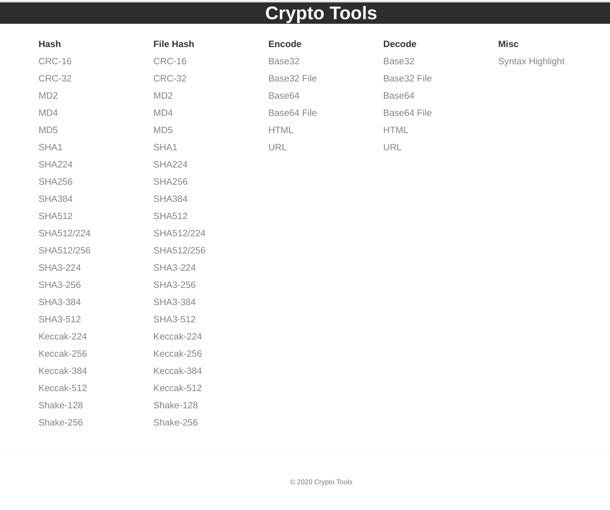
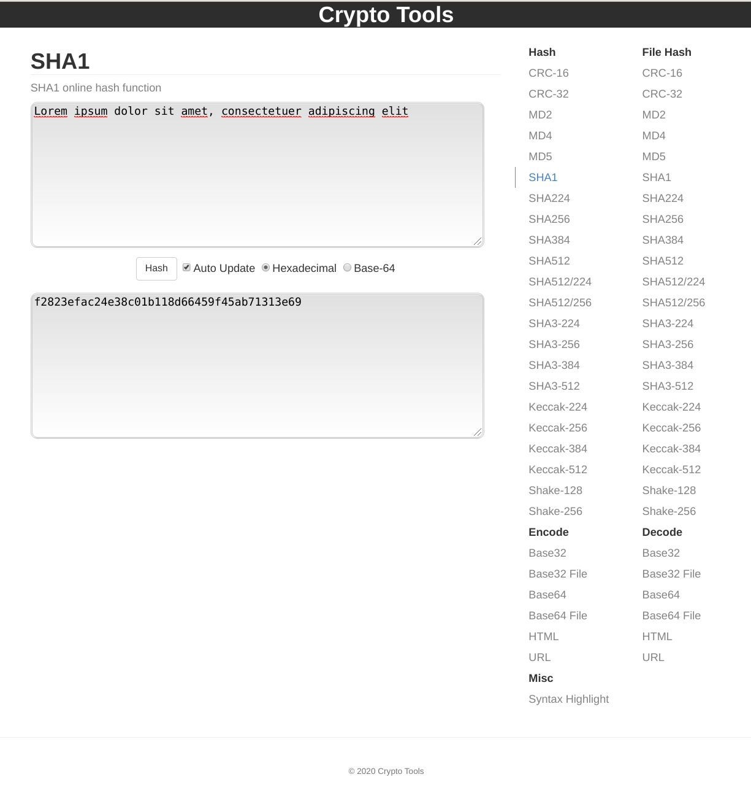

# Crypto Tools

### Set of tools for some crypto- and data- conversions based on JavaScript.

_Based on [these](https://github.com/emn178/online-tools) sources with some modification. Many thanks for this!_

> Implemented algorithms those like - `md2`, `md4`, `md5`, `sha1`, `sha2`, `sha256`,`sha512`, `base32`, `base64`, `url encode/decode` and `html encode/decode` etc

- [MD2](https://en.wikipedia.org/wiki/MD2_(hash_function)) `Wiki`
- [MD4](https://en.wikipedia.org/wiki/MD4) `Wiki`
- [MD5](https://en.wikipedia.org/wiki/MD5) `Wiki`
- [SHA-1](https://en.wikipedia.org/wiki/SHA-1) `Wiki`
- [SHA-2](https://en.wikipedia.org/wiki/SHA-2) `Wiki`
- [SHA-3](https://en.wikipedia.org/wiki/SHA-3) `Wiki`
- [Base32](https://en.wikipedia.org/wiki/Base32) `Wiki`
- [Base64](https://en.wikipedia.org/wiki/Base64) `Wiki`
- [Percent-encoding (URL encoding)](https://en.wikipedia.org/wiki/Percent-encoding) `Wiki`
- [HTML character encoding](https://en.wikipedia.org/wiki/Character_encodings_in_HTML) `Wiki`


## Why?

The main goal was to build full offline service without external dependencies for browser and tracking code for security reasons and full audit. It also added all libraries with not minified sources (except `highlight.js`). Service built on `Docker` with `Nginx` based on `Alpine Linux` with full-cycle of automaticity build and can work offline. It also can be built locally without the need to install `Node.js` and `NPM`.

---

### Screenshots





---

### Run in a `Docker`

```shell
docker run --rm -p 8080:80 binlab/crypto-tools:latest
```

Then open in a browser: http://localhost:8080/

---

### Build from sources by `Docker`

```shell
docker build -t crypto-tools:latest .
```

---

### Build from sources by `NPM`

```shell
npm install
npm run build
```

Then open locally in a browser:

```shell
# For Linux
xdg-open file://${PWD}/dist/index.html

# For MacOS
open file://${PWD}/dist/index.html

# Other (paste a result in browser)
echo "file://${PWD}/dist/index.html"
```